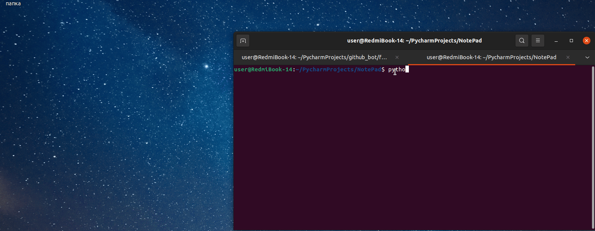

# NotePad
<b> Your own notebook written in python.</b>
<p>
  
  
  
  
  
  

  
  
  
</p>


Read in other languages: [English](README.md), [हिन्दी](README.hindi.md), [Russian](README.ru.md)





##如何安裝和運行
____
### 克隆存儲庫
 
```sh
$ cmd
$ git clone https://github.com/BEPb/NotePad
$ cd NotePad
```
 
### 安裝必要的包（安裝依賴）
```sh
$    -r requirements.txt
```

＃＃ 用法
要啟動 GUI：
```
python3 -m main
```


