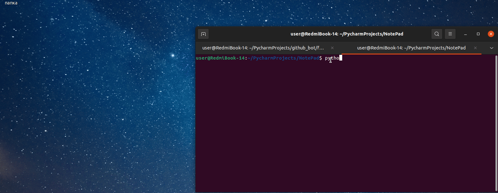

# NotePad
<b> Your own notebook written in python.</b>
<p>
  
  
  
  
  
  

  
  
  
</p>


Read in other languages: [Russian](README.ru.md), [हिन्दी](README.hindi.md), [中國人](README.chinese.md)





## How to install and run
____
### Clone the repository
 
```sh
$ cmd
$ git clone https://github.com/BEPb/NotePad
$ cd NotePad
```
 
### Install the necessary packages (Install dependencies)
```sh
$   pip install -r requirements.txt

```

## Usage
To launch the GUI:
```
python3 -m main
```

